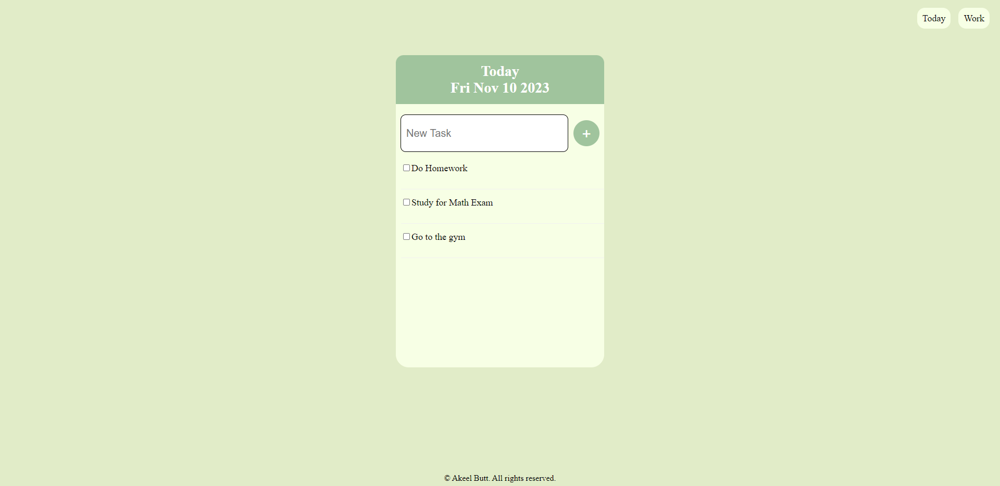

# To-Do-List

## Overview

This project is a basic To-Do application that allows users to manage tasks for today and work separately. It is built using the Express.js framework for the server, EJS for templating, HTTP methods to handle communication between the client and the server, and body-parser for handling form data.

## Features

-Add tasks for today and work separately.
-View and manage tasks for today and work.
